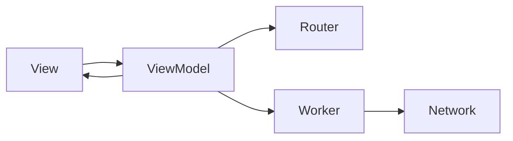

# Technical Test
First, run `make init` to install required dependencies

Create a simple application that fetch a list of news from 3 differents sources.
The project must be open with Xcode 14.3, I also join a video of the application

The user can :
- see a list of article
- see the details of an article (Added)

### Architecture
I use a `MVVM` archicure with `DDD` (Domain Driven Design). 

And this will produce a flow chart:

(If you're not seeing the diagram, you can add [this extension](https://github.com/BackMarket/github-mermaid-extension) to see `mermaid` diagram)

My folder are split in : 
```
|- Data
  | - Model
  | - Resources
  | - Services
  | - Workers
| - Design
  | - Components
  | - UI
| - Extension
| - Main
| - Resources
| - Screens
| - UI Bridges
```

The `Data` and `Design` can be extrat in dependency if we want to reuse it.
`Data` contains all the logic about `Model` and how to fetch the data
`Design` contains all reusable view, component and all stuff regarding the design

All `Service`, `Worker` and `Router` have some `protocol` (easy to change implementation if we want)

### UnitTests
`NetworkService`, `Worker`, `ViewModel` should be tested here. We have no model with some logic.

`Service`, `Worker`, `Router` and `Model` should be mock for test.


### Resources
I used `SwiftGen` to generate: 
- assets
- localization
- color
If we change the name, the app will not compile.

### Package
I use 
- `alamofire` : Api request
- `Require`
- `Swinject`: dependencies injection

For test:
- `InstantMock`: create Mocks Easily
- `OHHTTPStub`: to mock Api request


### Completion
This code is not ready for Production